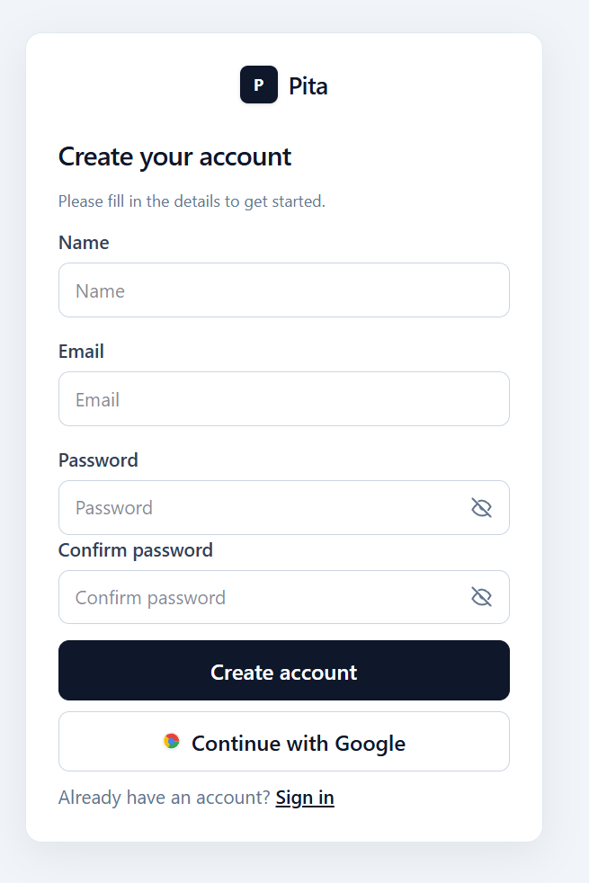
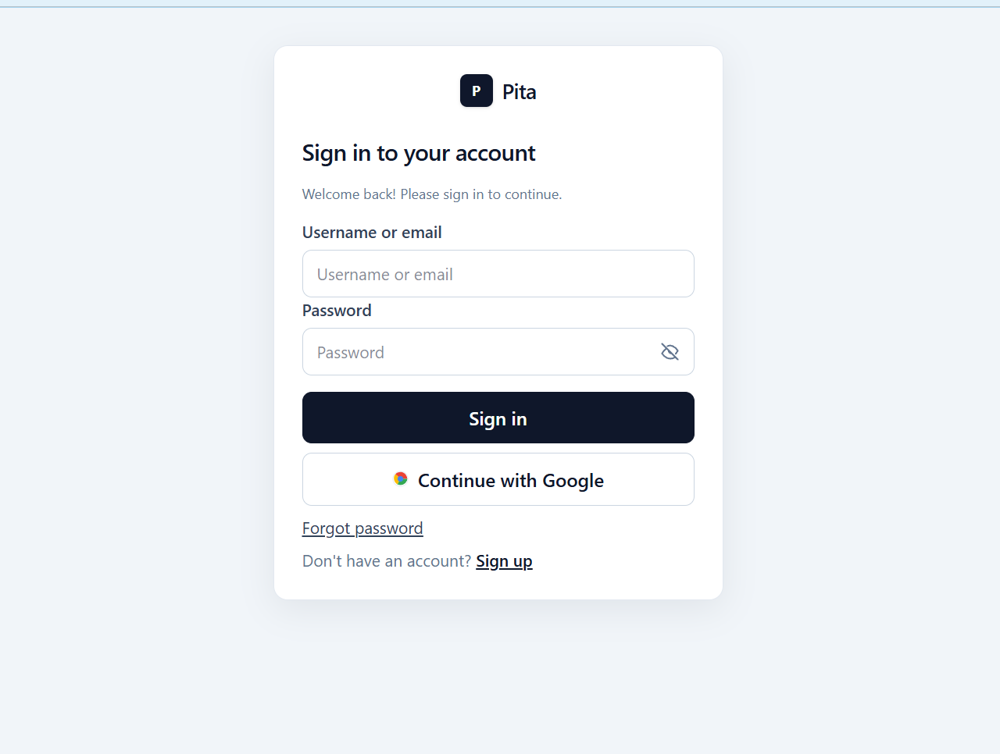
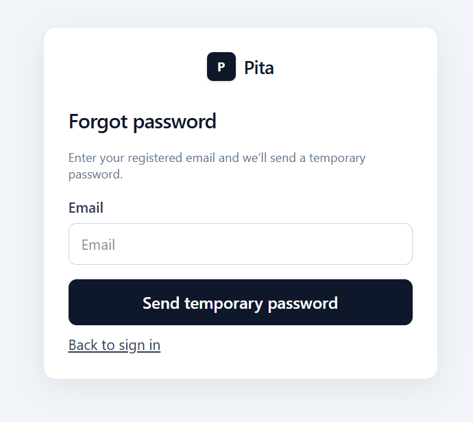
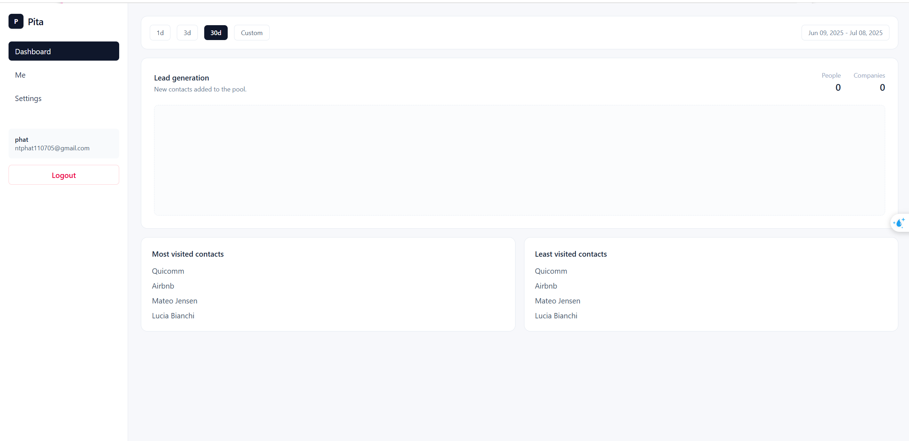
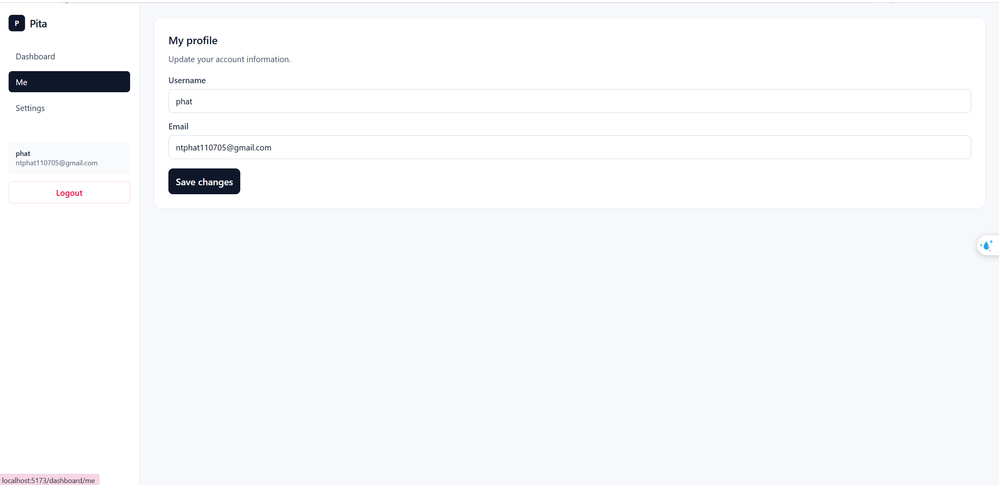
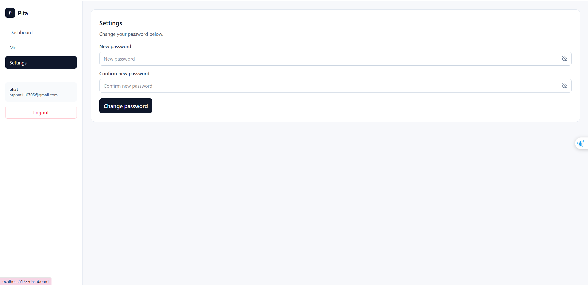

# Hướng Dẫn Chạy Web Local (Backend + Frontend)

Tài liệu này mô tả cách chạy dự án `SimpleApp` trên máy local, bao gồm:

- Chuẩn bị môi trường.
- Cách chạy backend và frontend.
- Các luồng hoạt động chính của web hiện tại.
- Ảnh màn hình giao diện hiện có.

## 1) Tổng quan kiến trúc hiện tại

- `backend`: API xác thực, quản lý phiên, gửi mail, kết nối PostgreSQL.
- `frontend`: giao diện React cho đăng ký/đăng nhập/quản lý tài khoản.
- `postgres`: lưu dữ liệu người dùng.
- `rabbitmq`: hàng đợi gửi email (xác thực email, mật khẩu tạm).

## 2) Yêu cầu trước khi chạy

- Node.js 20+ (khuyến nghị bản LTS mới).
- npm 10+.
- Docker Desktop (để chạy PostgreSQL và RabbitMQ qua Docker Compose).

## 3) Chạy backend local

### Bước 1: Vào thư mục backend

```bash
cd backend
```

### Bước 2: Tạo file môi trường

```bash
cp .env.example .env
```

Điền các biến cần thiết trong `.env`:

- `DATABASE_URL`
- `FRONTEND_URL`
- `BACKEND_URL`
- `JWT_ACCESS_SECRET`
- `JWT_REFRESH_SECRET`
- `SMTP_HOST`, `SMTP_PORT`, `SMTP_USER`, `SMTP_PASS`, `SMTP_FROM`
- `RABBITMQ_URL`, `RABBITMQ_MAIL_QUEUE`
- `GOOGLE_CLIENT_ID`, `GOOGLE_CLIENT_SECRET`, `GOOGLE_REDIRECT_URI`

### Bước 3: Chạy dịch vụ hạ tầng bằng Docker

```bash
docker compose up -d
```

Dịch vụ sẽ được tạo:

- PostgreSQL: `localhost:5433`
- RabbitMQ:
     - AMQP: `localhost:5672`
     - Management UI: `http://localhost:15672`

### Bước 4: Cài thư viện backend

```bash
npm install
```

### Bước 5: Chạy backend

```bash
npm run dev
```

Backend mặc định chạy ở:

- `http://localhost:4000`
- Health check: `http://localhost:4000/api/health`
- Swagger docs: `http://localhost:4000/api/docs`

## 4) Chạy frontend local

### Bước 1: Vào thư mục frontend

```bash
cd frontend
```

### Bước 2: Tạo file môi trường

```bash
cp .env.example .env
```

Thiết lập:

- `VITE_API_URL=http://localhost:4000/api`

### Bước 3: Cài thư viện frontend

```bash
npm install
```

### Bước 4: Chạy frontend

```bash
npm run dev
```

Frontend thường chạy ở:

- `http://localhost:5173`

## 5) Luồng hoạt động chính của web hiện tại

## Luồng 1: Đăng ký tài khoản

1. Người dùng nhập `username`, `email`, `password` ở trang Sign Up.
2. Frontend gọi `POST /api/auth/signup`.
3. Backend tạo user ở trạng thái chưa xác thực email.
4. Backend gửi email xác thực (qua RabbitMQ hoặc fallback gửi trực tiếp SMTP).
5. Người dùng mở link xác thực email.
6. Backend xác thực token và chuyển về trang đăng nhập.

## Luồng 2: Đăng nhập

1. Người dùng nhập `username/email` và `password`.
2. Frontend gọi `POST /api/auth/login`.
3. Backend kiểm tra thông tin đăng nhập + trạng thái xác thực email.
4. Nếu hợp lệ, backend set `HttpOnly Cookie` cho access/refresh token.
5. Frontend cập nhật state đăng nhập và chuyển vào dashboard.

## Luồng 3: Duy trì phiên và tự refresh token

1. Khi API trả `401`, Axios interceptor trên frontend sẽ xử lý.
2. Frontend gọi `POST /api/auth/refresh` để cấp phiên mới.
3. Nếu refresh thành công, request cũ được chạy lại.
4. Nếu refresh thất bại, frontend logout và chuyển về `/signin`.

## Luồng 4: Quên mật khẩu

1. Người dùng nhập email tại trang Forgot Password.
2. Frontend gọi `POST /api/auth/forgot-password`.
3. Backend tạo mật khẩu tạm và bật cờ `requiresPasswordChange`.
4. Backend gửi mật khẩu tạm qua email.
5. Người dùng đăng nhập bằng mật khẩu tạm rồi đổi mật khẩu mới.

## Luồng 5: Bắt buộc đổi mật khẩu

1. Nếu tài khoản có `requiresPasswordChange=true`, route bảo vệ sẽ chặn.
2. Frontend tự điều hướng đến trang `/change-password`.
3. Người dùng đổi mật khẩu qua `POST /api/auth/change-password`.
4. Backend xóa phiên cũ, yêu cầu đăng nhập lại với mật khẩu mới.

## Luồng 6: Đăng nhập Google OAuth

1. Người dùng bấm nút đăng nhập Google.
2. Trình duyệt chuyển sang `GET /api/auth/google`.
3. Sau consent, Google callback về `GET /api/auth/google/callback`.
4. Backend tạo hoặc ghép user, set cookie phiên và redirect về dashboard.

## Luồng 7: Hồ sơ người dùng

1. Frontend lấy thông tin hiện tại bằng `GET /api/users/me`.
2. Trang Settings cập nhật thông tin bằng `PATCH /api/users/me`.

## 6) Tài khoản demo (seed)

Backend hiện có seed dữ liệu demo:

- `admin@simpleapp.local` / `Admin@123`
- `demo@simpleapp.local` / `Demo@123`

## 7) Ảnh màn hình hiện có

Các ảnh nằm cạnh tài liệu trong thư mục `docs/images` (đường dẫn tương đối để Markdown Preview trong Cursor/VS Code hiển thị được).

## Đăng ký



## Đăng nhập



## Quên mật khẩu



## Dashboard tổng quan



## Dashboard - Thông tin cá nhân



## Dashboard - Cài đặt



## 8) Lệnh kiểm tra nhanh

### Backend

```bash
cd backend
npm run test
npm run lint
```

### Frontend

```bash
cd frontend
npm run test
npm run lint
```
